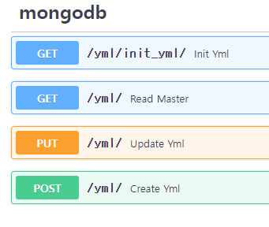

# change_yaml_config

yaml 파일을 mongoDB에 저장하고 그 데이터를 통해서 다시 yaml 파일을 수정하는 API입니다.  
json과 yaml 형식을 변환하면서 저장합니다.  

## Requirement
```bash
docker
docker-compose
```

## Environment
**Backend**: FastAPI  
**DataBase**: MongoDB  

## RUN
```bash
$ docker-compose up -d
```

## API

```bash
GET /yml/init_yml/ : docker-compose.yml 파일을 읽어서 mongoDB에 저장합니다.
GET /yml/ : mongoDB에 저장된 데이터를 불러옵니다.
PUT /yml/ : mongoDB에 저장된 데이터를 수정합니다.
POST /yml/ : mongoDB에 저장된 데이터를 docker-compose.yml에 덮어씁니다.
```
> init_yml을 POST로 하는 것이 더 의미상 맞는거 같습니다.
